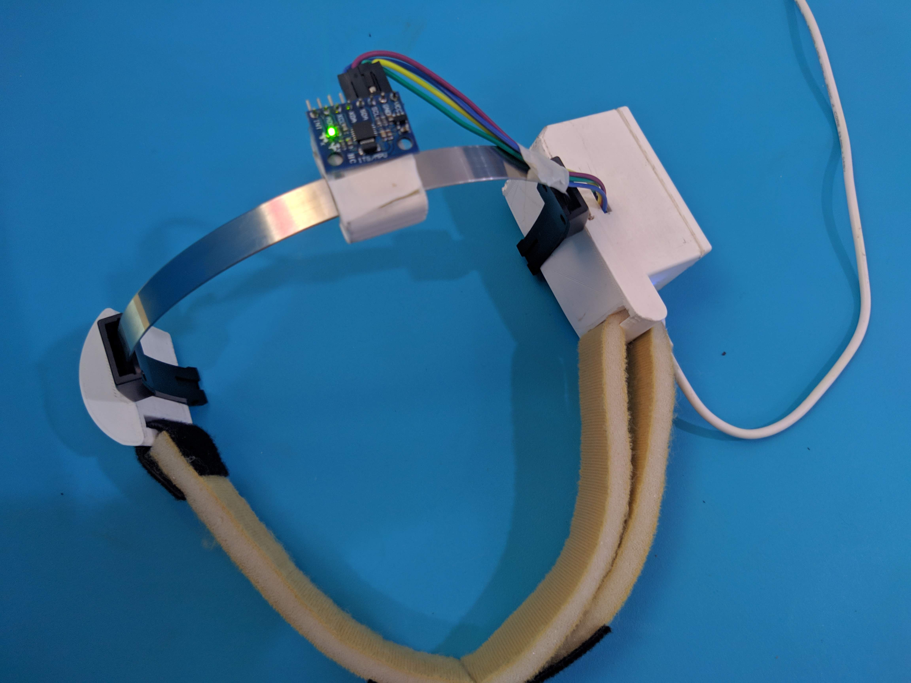
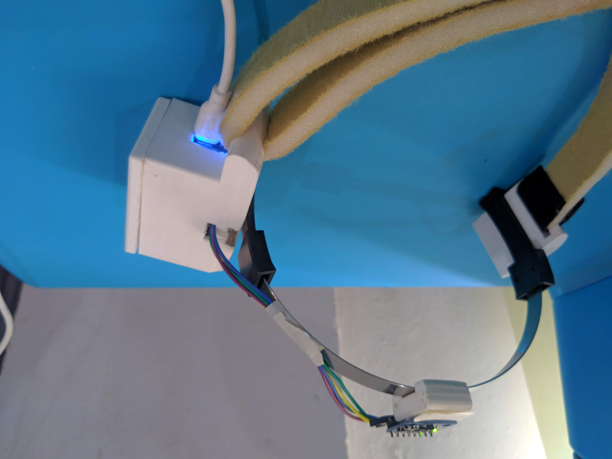
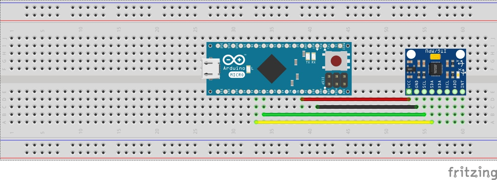

# Head-Mouse-NISH
This project was created for assisting quadriplegic people to to use computers and AAC devices easily, as a part of my internship period at NISH.

## Gallery

## Acknowledgement
The main idea for this project was borrrowed from the instructables page of Gabry295. The code by him was analysed and refined in order to make  perfect working head controlled mouse.
Mrs Akila Surendran was enthusiastic in completing this project and using it in different ways for the disabled people to work with.
Mr Amith G Nair was the backbone to this project sharing his ideas and creating the head mouse in the most user friendly way possible by creating 3D printed cases and basic layout diagrams of this whole project.
The entire NISH faculty whose sessions I observed gave me the idea for the refinements. They were more than happy to share any knowledge they had to help for the completion of this project.
Please visit this website to learn about this amazing institution in Kerala, India and how they chage the lives of the disabled people: http://nish.ac.in

## Problem statement
During my internship period at NISH (National Institute of Speech & Hearing) I had the chance to observe different conditions that were treated there. I noticed that people who were paralysed neck below had a huge problem communicating using Augmentative and alternative communication (AAC) techniques. When discussing this idea with the Centre for Assistive Technology & Innovation, they suggested on further developing an ongoing research there, the head controlled mouse. This could help the suffering people a lot in their day to day life and also in their therapy sessions.

## Process of development
We started at first by placing the layout of the setup on paper. We decided to go for the Arduino micro-controller for the initial development phase since it already has the required mouse.h library in-built and also because any coding and changes to be made would be much easier compared to commercial microcontrollers.
### Components required
1) Arduino Micro
2) MPU6050 Gyroscope sensor
3) Connecting wires
4) Micro USB cable for connection with computer
5) Straps
6) Arduino IDE in computer for burning the code (only during development and not necessary after burning as device is plug and play)
### Steps
1) Gather components
2) Make connections as follows

SDA-A2
SCL-A3
VCC-5V
GND-GND
3) Use any method to strap the MPU6050 on the head.
4) Burn the code from the .ino file into the arduino using the Arduino IDE tool
5) Calibrate any changes if necessary.
6) Plug the micro usb into the Arduino and the USB in to any USB port and enjoy the Head controlled mouse.
### Libraries required
1) mouse.h (in-built library)
2) wire.h (in-built library)
3) MPU6050.h (http://downloads.arduino.cc/libraries/github.com/ElectronicCats/MPU6050-0.0.1.zip) (Click on sketch -> Include Library -> Add .ZIP Library)
4)I2CDEV.h (https://codeload.github.com/jrowberg/i2cdevlib/zip/master) (Click on sketch -> Include Library -> Add .ZIP Library)
5) MouseTo.h (Optional)(FIND IN GITHUB)
### Code
Find the .ino file in the code section.
### Problems faced
#### 1) Calibration
This was the most time consuming and painstacking problem which was solved only after days of calibration to make the mouse into a usable device
#### 2) Out of Bounds cursor
This a problem which couldn't be solved yet.When the mouse pointer goes out of bounds of the screen, the pointer doesnot move but the gyroscope would be still active making the device uncalibrated. If a solution has been found please contact me and I'll post the update on the GitHub page giving credit in your name.
#### 3) Ghost movement of cursor due to noise signals from Gyroscope module
The problem was deeply enhanced due to problem no 2. This was solved simply enough by reducing the sesitivity of the gyroscope module and increasing that of the pointer so that in effect there is no change in the mouse sensitivity and the minute noise from the gyroscope is neglected.
## Contact details
Please feel free to contact me on the Email ID: unnivarun99@gmail.com for any queries or updates and please use this project to help maximum people.
## Credits
I thank Mrs Akila Surendran for total support on the development of this project and & Mr Amith G Nair for the developing this project with me providing me all the technical advices and making the 3D printed case for enclosing the device.
## References
https://www.instructables.com/id/Head-Mouse-With-MPU6050-and-Arduino-Micro/
http://fab.academany.org/2018/labs/fablabtrivandrum/students/akila-surendran/Final%20project/finalproj.html
https://github.com/AkilaSurendran/Centre-for-Assistive-Technology-and-Innovation-CATI-NISH-Trivandrum
